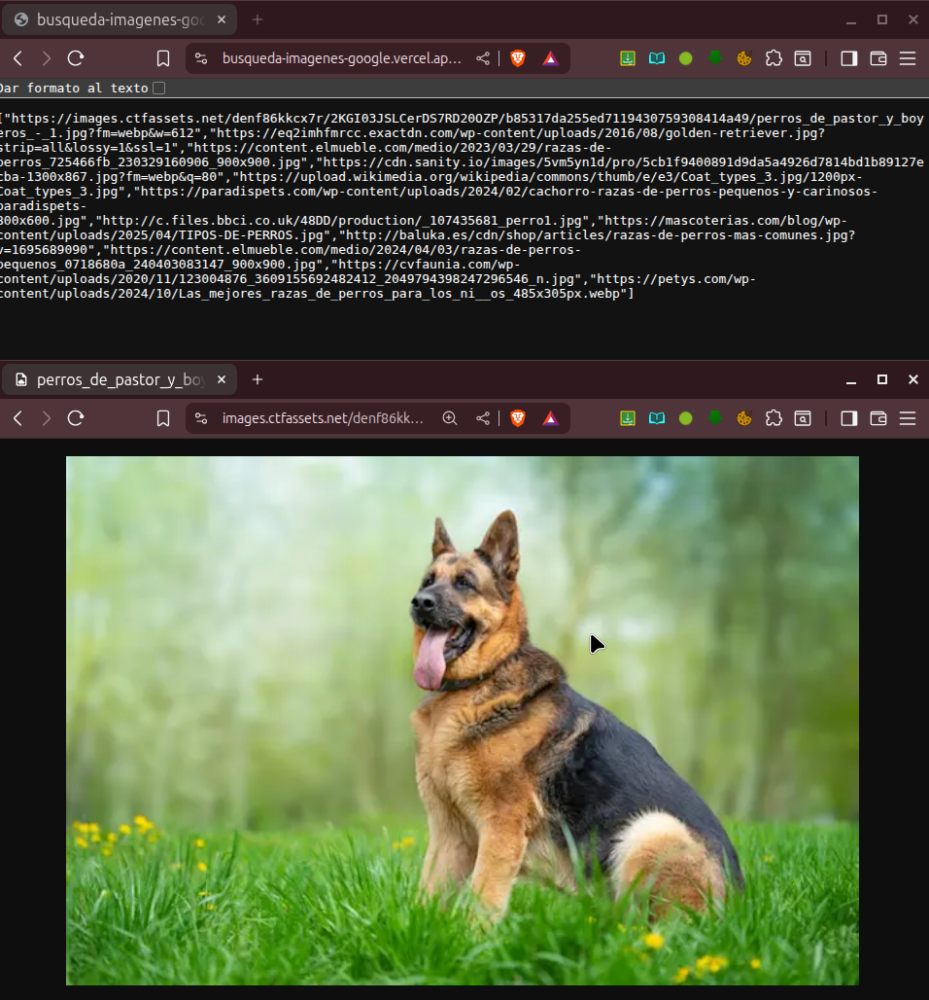

# Servidor de Búsqueda de Imágenes con SerpApi y Express
Servidor Node.js que usa SerpApi para buscar imágenes en Google y devolver sus URLs.



---

## Requisitos

- Node.js  
- Clave de SerpApi ([serpapi.com](https://serpapi.com/))  
- Archivo `.env` con `SERP_API_KEY`  

---

# Ejemplo 

Accede a:  
https://busqueda-imagenes-google.vercel.app/buscar?q=perros  
y devuelve hasta 12 URLs de imágenes relacionadas con perros.

---

## Endpoint

### `GET /buscar?q=tu_busqueda`

Devuelve hasta 12 URLs de imágenes relacionadas.

---

## Ejemplo de respuesta

```json
[
  "https://ejemplo.com/imagen1.jpg",
  "https://ejemplo.com/imagen2.jpg"
]
```

Errores comunes:

- `400`: Falta el parámetro `q`  
- `404`: Sin resultados  
